[](https://classroom.github.com/a/2WEVFWWf)

# What is Angular? 

Web Applications framework for Single Page Apps (SPAs).  

- UI framework built by Google 
- libraries: React, MomentJS, Lodash 
- features: Template, Data Binding, Forms, Routing, Observables, PWA. 


## Angular vs React

| Feature                  | Angular                             | React                             |
|--------------------------|-------------------------------------|------------------------------------|
| Framework Type     | Full framework  | UI library  |
| Language           | TypeScript | JavaScript (with JSX)   |
| State Management   | Services / RxJS / NgRx      | useState, Redux, Hooks |
| Routing            | @angular/router built-in    | React Router   |
| CLI and Tooling          | Strong out-of-box CLI | CRA/Vite or manual config |
| Learning Curve           | Steeper (more concepts)  | More flexible but fragmented |


---

## Getting Started with Angular

### Prerequisites

- HTML
- CSS or SCSS
- TypeScript - https://www.typescriptlang.org/


### Tools

- VSCode
- Git
- Node.js - https://nodejs.org/en
- Angular CLI - https://angular.dev/tools/cli/setup-local
<br />
Install with:  <br />

```bash
npm install -g @angular/cli
```

check version: <br />

```bash
ng version
```

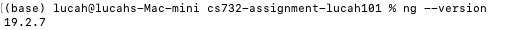

- Angular DevTools (optional, Chrome extension)
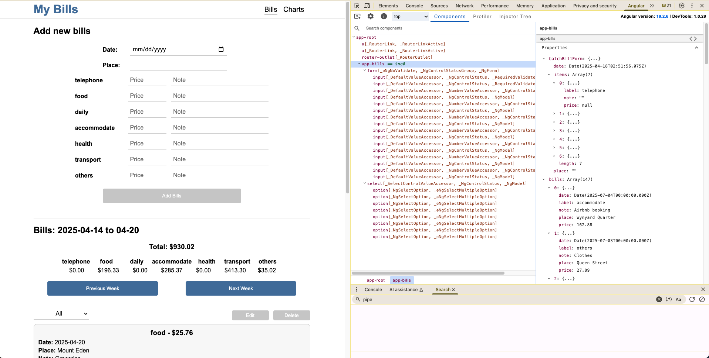


### Create a new Angular project
1. new project
```bash
ng new your-project-name
```
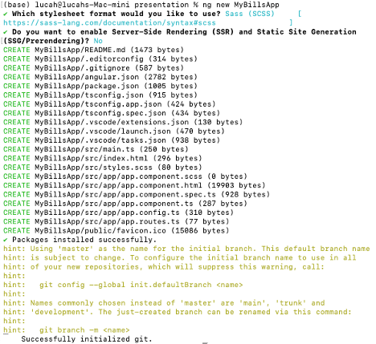

In VS Code:
2. install and run the project
```bash
npm install
ng serve
```
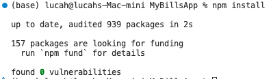
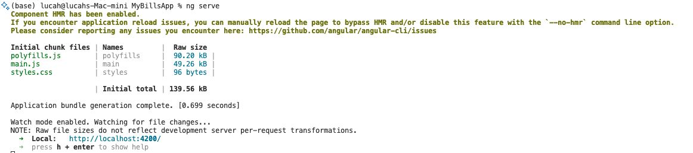
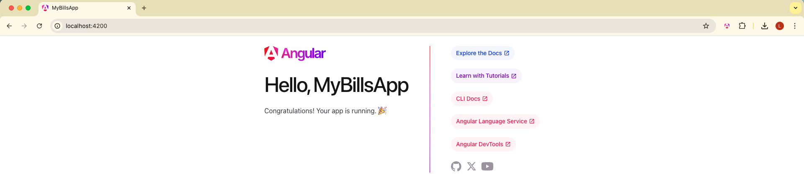

3. create a new component
```bash
ng generate component your-folder-name
```


4. check the selector and component name <br />
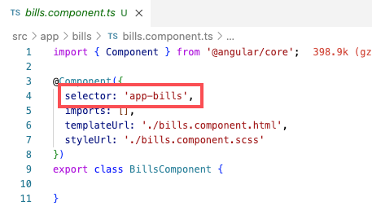

5. add the component
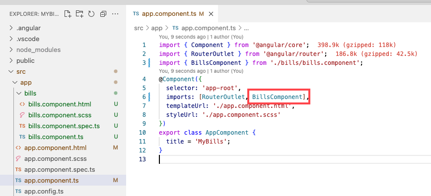

6. add the selector into HTML file <br />
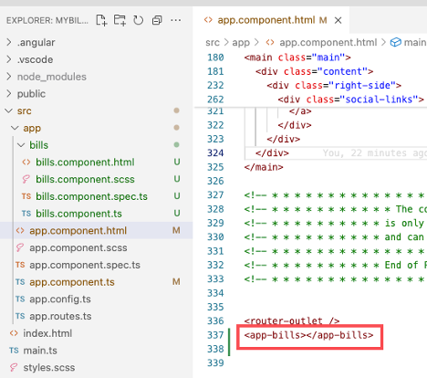

7. add routing <br />
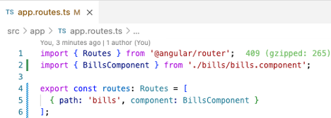
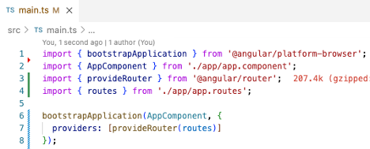
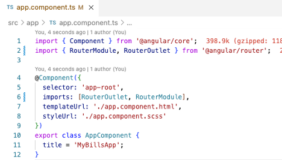
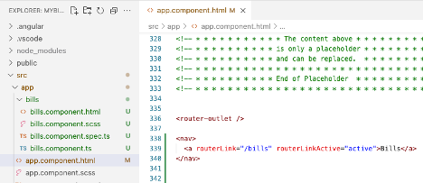
<br />
you can click the link on the page.  <br />

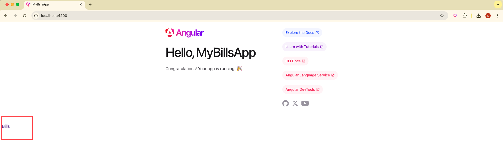
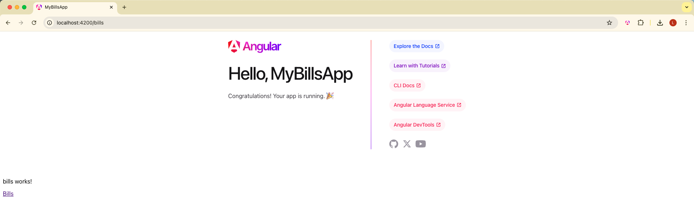


### Install My Bills Project

1. Clone the repository:
   ```bash
   git clone https://github.com/UOA-CS732-S1-2025/cs732-assignment-lucah101.git
   ```

2. Open in VS Code

3. Install:
   ```bash
   npm install
   ```

4. Run the project:
   ```bash
   ng serve
   ```

5. Visit in browser:
   ```
   http://localhost:4200
   ```


---

# My Bills Project

This is a demo project built with Angular, showcasing a categorized expense tracking interface. The project demonstrates Angular’s component structure, form handling, stateful interaction, and chart rendering. Include application structure, tool support, state management and routing. 

- bills: 
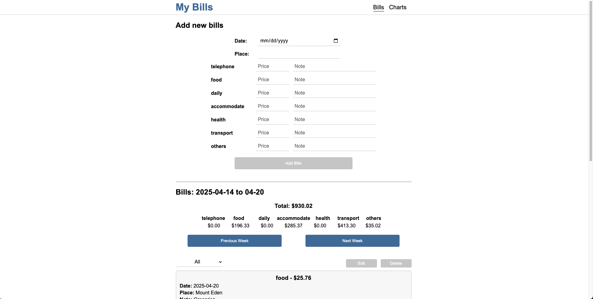 

- charts: 
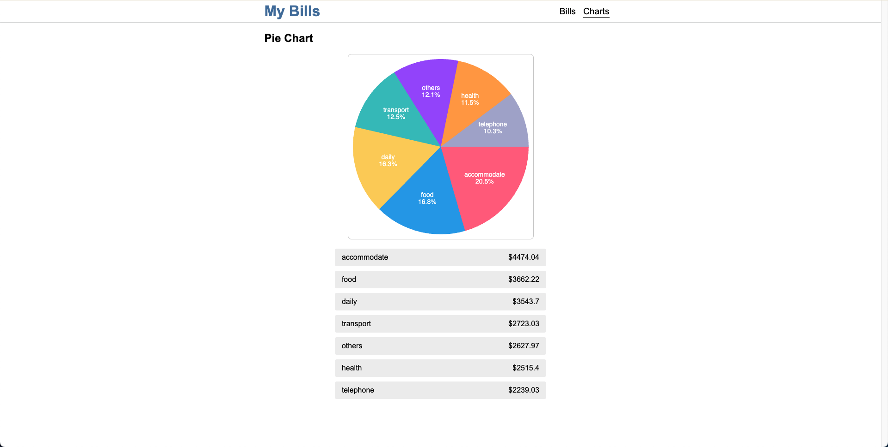


## Tech Stack

| Layer          | Technology                  |
|----------------|-----------------------------|
| Frontend       | Angular (v16+)              |
| Language       | TypeScript + HTML + SCSS    |
| State handling | Component state + ngModel   |
| Chart          | Native Canvas API           |
| Styling        | SCSS                        |
| Tooling        | Angular CLI, VS Code        |


## Features

- Add new expenses with batch input
- Real-time category summaries
- Filter and view weekly total spendings
- Inline edit / delete support
- Pie chart visualization with Canvas API


## Application Structure

```
src/
    app/
        components/
            bills/                          # BillsComponent: core input + data handling
                bills.component.html
                bills.component.scss
                bills.component.spec.ts     # Unit test (not included in this demo)
                bills.component.ts      
                bills.data.ts
                bills.model.ts
            charts/                         # ChartsComponent: canvas-based pie chart
                charts.component.html
                charts.component.scss
                charts.component.spec.ts    # Unit test (not included in this demo)
                charts.component.ts
        app.component.ts         
        app.config.ts           
        app.routes.ts            
    index.html
    main.ts
    style.scss
```
| page           | function                    |
|----------------|-----------------------------|
| bills.component.html       | Form UI: batch input per label, dynamic filter| 
| bills.component.scss       | Scoped styles for bill layout and form controls| 
| bills.component.ts         | Component logic: add/edit/delete bills, weekly stats| 
| bills.model.ts             | TypeScript model (Bill interface)
| bills.data.ts              | mock bills data
| charts.component.html      | Chart + label list UI| 
| charts.component.scss      | Chart display & active slice styles| 
| charts.component.ts        | Canvas-based pie chart, dynamic hover & label filtering| 
| app.component.ts           | Provides the header and navigation using <router-outlet> for SPA routing| 
| app.config.ts              | Angular standalone app config: router + zone optimization| 
| app.routes.ts              | Routes setup for "bills" and "charts"| 
| index.html                 | Host HTML| 
| main.ts                    | Bootstrap Angular app with appConfig| 
| style.scss                 | Global styles| 


## Tool support
|Tool	|Purpose|
|----------------|-----------------------------|
|Angular CLI	|Project scaffolding, component generation, local dev server|
|TypeScript	|Strongly typed JavaScript for safer and more scalable code|
|SCSS	|Stylesheets with nesting, variables, and better organization|
|Canvas API	|Native drawing for high-performance pie charts|
|Angular Router	|Built-in navigation between components|
|FormsModule	|Enables template-driven forms and two-way data binding|


## State management
This project uses component-level state management. 
Form Data: Managed via ngModel two-way binding
Local Variables:
- bills[ ]: Global list of all bills
- filteredBills[]: Bills displayed for the selected week
- selectedLabel: Filter condition
- editIndex: Tracks the bill currently being edited
- selectedBillIndex: Tracks which bill is selected
- totalByLabel: Calculated totals by category
- batchBillForm: Contains date, place, and an array of bills grouped by label

## Routing
app.routes.ts: 
```bash
export const routes: Routes = [
  { path: '', redirectTo: 'bills', pathMatch: 'full' },
  { path: 'bills', component: BillsComponent },
  { path: 'charts', component: ChartsComponent }
];
```
- The root path redirects to /bills
- /bills handles all logic for input, filtering, and editing
- /charts displays a pie chart visualization of current weekly spending


